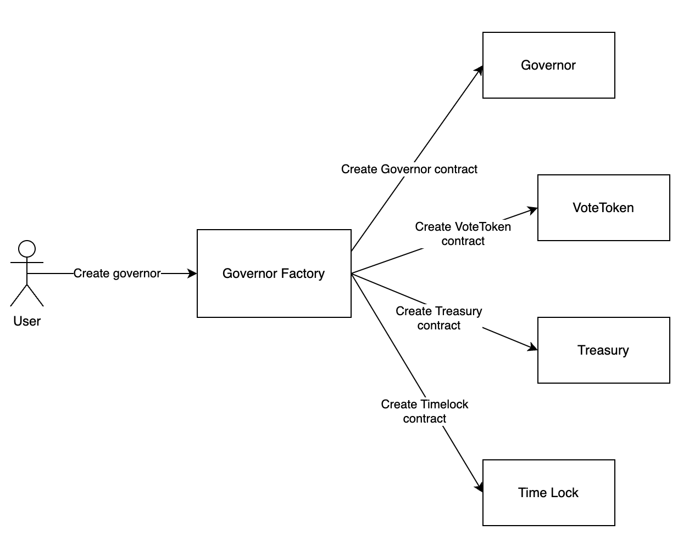

# Hedera DAO smart contract



## Governor factory
Contract for:
- Onboarding new Governor and Vote token preset.
- Creating new governor (a set of 4 contracts: Governor, Vote token, Timelock, Treasury)
## Folder structure
### Governor Templates
Contains all supported governor presets
### Vote tokens
Contains all vote token presets
## Onboarding new Preset
- Write preset in [Upgradeable](https://docs.openzeppelin.com/upgrades-plugins/1.x/writing-upgradeable) form. Use [Upgradeable](https://docs.openzeppelin.com/upgrades-plugins/1.x/writing-upgradeable) to utilize [Minimal Proxy](https://blog.openzeppelin.com/deep-dive-into-the-minimal-proxy-contract) will reduce lots of gas fee for calling `createGovernor`.
- Deploy preset at an address then add it into `GovernorFactory` contract.
- See example scripts in `scripts/deploy_hashgraph.ts`
## Create Governor
- `createGovernor` requires `_governorInitializeData` and `_voteTokenInitializeData`. These parameters use for initializing state for new governor and vote token contract. Each preset has its own set of initialize parameter, so we use this way for the flexibility.
- See example in test file `tests/GovernorFactory.test.ts`
## Deploy new set of smart contracts
```sh
    ts-node scripts/deploy_hashgraph.ts
```